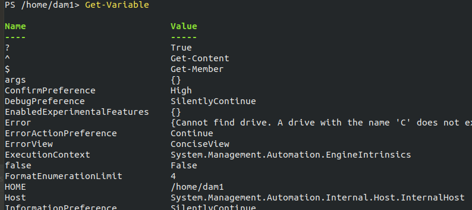
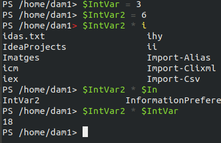

#Comparacion
Variable and Comparison Operators

Task 1

Assign a variable with each datatypes covered in the

previous workshop

The datatypes previous covered were “Boolean”, “String”, “Int”

Notes:

$BoolanVar = $True

$StringVar = "This is a string"

$IntVar = 42

Task 2

List all variables currently loaded in to memory.

The noun within the cmdlet is “Variable”

Notes:

Get-Variable

Task 3

Multiple two Int variables together

PowerShell can perform basic maths operators, such as “+”, “-“ and “\*”

Notes:

$IntVar1 = 4

$IntVar2 = 10

$IntVar1 \* $IntVar2

Task 4

First declare two Int variables. Then divided the first

variable by the second and assign the result to a

variable named $VariableResult

The easiest way to do this is within the Integrated Scripting Environment

(ISE) using multiple lines of code

Notes:

$IntVar3 = 10

$IntVar4 = 2

$VariableResult = $IntVar3 / $IntVar4

Task 5

Typecast a Variable as a “String” and assign it a value

of 5

Remember to normal brackets \[\] rather than curly brackets {} when

typecasting a variable

Notes:

\[String\]$TypecastVar = 5

